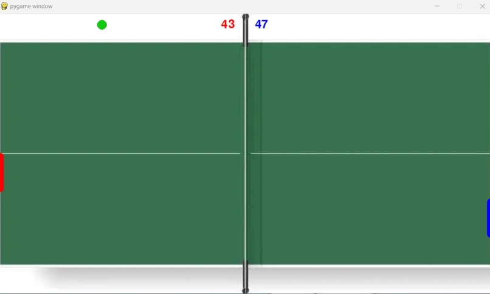

# Gesture-Controlled Ping Pong Game

A Python-based interactive ping pong game where players control paddles using hand gestures via webcam. Built with OpenCV, Mediapipe, and Pygame.

<p align="center">
  
</p>

## Requirements

- **Python 3.8.1**
- Libraries:
  ```bash
  pip install opencv-python pygame numpy mediapipe
